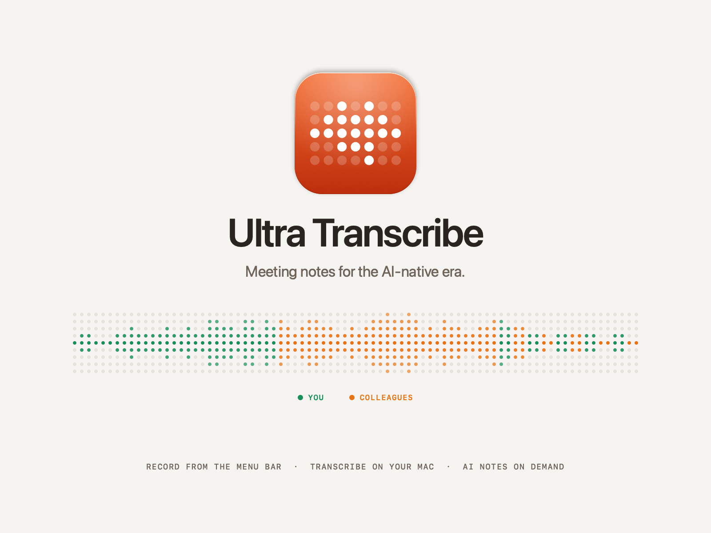

<p align="center"></p>

# Ultra Transcribe

**Meeting notes for the AI-native era.** Ultra Transcribe is a macOS menu-bar app for teams that meet often and need clear notes fast. Start a meeting in one click, get an accurate transcript that shows what you said and what your colleagues said, then turn it into a summary, decisions and action items when you need them.

- **One click from the menu bar.** Meetings start instantly and name themselves. No window to manage, no Dock icon.
- **Clear speaker labels.** Your microphone is recorded as **You** and your Mac's call audio as **Colleagues**, on separate tracks.
- **Transcribed on your Mac, while you talk.** Qwen3-ASR runs locally on Apple Silicon and the transcript is ready seconds after you stop. Quiet voices and whispers are picked up. Audio is never uploaded.
- **Multilingual by design.** People can switch languages sentence by sentence; you choose which languages your meetings use.
- **AI notes on demand.** Click **Analyze with AI** to send the transcript text to the OpenRouter model you choose, with templates for different kinds of meetings.

Ultra Transcribe is built for consensual meetings. Let participants know when you record.

By [achraf.tn](https://achraf.tn) · [ultra.achraf.tn](https://ultra.achraf.tn)

## Install

Download the latest release from [Releases](https://github.com/Ashref-dev/ultra-meet-v2/releases), unzip it and move **Ultra Transcribe** to Applications. Requires an Apple Silicon Mac with macOS 15 or later.

This pre-release is signed for development and not yet notarized. On first launch, right-click the app and choose **Open**. The download contains no speech models; a short setup walks through microphone and Mac audio permission, downloads the speech model you pick, sets your languages and an optional OpenRouter key.

Updates: Settings → Credits checks for new releases and installs them in place, after verifying that the download is Ultra Transcribe signed by the same developer. The app also checks once a day and tells you when a new version is out; you can turn that off.

## Use

- **Left-click** the menu-bar icon for the recorder: choose You and Colleagues, then **Start recording**. While recording you see the meeting name (click to rename), talk time per side, the latest transcript lines, a live waveform and a note field. A warning appears if your microphone is silent or no call audio plays on this Mac.
- **Right-click** the icon for Start, Pause, Resume, Stop, Meeting Library, Settings, updates and Quit. **⌃⌥⌘R** starts or stops recording from any app.
- **Stop** saves the audio, finishes the transcript and opens the meeting. A conversation map shows when each side spoke; click it or any timestamp to play both sides together, at up to 2×, with the current line highlighted. Lines are grouped into speaker turns, labeled by language in mixed-language meetings, and right-to-left languages align correctly. Click a line to play it, double-click to fix a typo. Unsure lines are underlined; right-click a line to transcribe it again as another language. Corrections offer to add new names to Names and terms.
- **Trash a meeting:** swipe left on its library row to reveal the round Trash button, then click and confirm. The meeting and its audio move to the Finder Trash for recovery. Recording and processing meetings cannot be trashed.
- **AI notes → Analyze with AI** produces a summary, discussion, decisions, action items for you and for your colleagues, and open questions. The model also gets talk time per side, the languages heard, your typed notes and which lines were unclear. Automatically named meetings get a descriptive title.

| Shortcut | Action |
|---|---|
| ⌃⌥⌘R | Start or stop recording, from any app |
| ⌘N | Start recording |
| ⌘⇧P | Pause or resume |
| ⌘⇧S | Stop and transcribe |
| ⌘L | Meeting library |
| ⌃⌘S | Toggle sidebar |
| ⌘, | Settings |

### macOS appearance

The recorder, library, settings and setup use native macOS materials, rounded controls and an orange accent. On macOS 26 and later, including macOS 27, action controls use Liquid Glass. Transcripts, notes and settings cards stay opaque for reading. Light, Dark and System appearance are in Settings → General. Reduce Transparency and Increase Contrast use solid control surfaces; Reduce Motion removes control transitions and the travelling progress pulse.

The library's native toolbar button or ⌃⌘S shows and hides the sidebar. macOS 15 remains supported with standard materials instead of Liquid Glass.

## Speech models

Measured on Apple Silicon while transcribing two minutes of real meeting audio.

| Model | Peak memory | Speed | Recommended for |
|---|---|---|---|
| Fast · Qwen3-ASR 0.6B 8-bit | 1.9 GB | about 85× real time | 8 GB Macs |
| Balanced · Qwen3-ASR 1.7B 8-bit | 3.5 GB | about 40× | 12 to 16 GB |
| Best · Qwen3-ASR 1.7B BF16 | 5.0 GB | about 27× | 16 GB and up |

Memory is used only while a meeting is being transcribed. Settings shows these numbers and recommends a model for your Mac.

## How transcription works

`Sources/Resources/worker.py` runs in a private Python runtime:

1. Each track is read as it is recorded, converted to mono 16 kHz and high-passed at 70 Hz.
2. Speech is found relative to each track's own noise floor, with no minimum loudness, so whispers and quiet microphones count. It is split at natural pauses, so each utterance is usually in one language. Quieter stretches become short clips of their own.
3. Each utterance is lightly denoised and normalized, which lifts quiet voices by up to 40 dB.
4. Qwen3-ASR detects the language of each utterance, limited to the languages you chose. When it is unsure whether quiet audio is speech, it tries again in the likeliest language and keeps a clear reading.
5. Both sides are transcribed in time order. Filler words, named sound events and microphone lines that repeat the call audio are removed, and every line keeps a confidence score.

On a 12-minute English and Saudi Arabic meeting, limiting detection to English and Arabic removed every misdetected language. `scripts/eval/eval.py` builds a mixed English, French and Arabic test meeting with known text; results are in [QA.md](QA.md).

## Privacy

- Audio and transcripts stay in `~/Library/Application Support/UltraTranscribe`.
- Nothing is sent anywhere unless you click Analyze with AI, validate a key, open the model catalog, download a model or install an update. The daily update check only reads the public release list on GitHub, and can be turned off in Settings → Credits.
- Your OpenRouter key is stored in the macOS Keychain.
- Audio of transcribed meetings is deleted after the retention period you choose; transcripts and notes are kept.

## Build from source

Use full Xcode and install `uv` (`brew install uv`) before building. If `xcode-select -p` points to Command Line Tools, prefix the build command with `DEVELOPER_DIR=/Applications/Xcode.app/Contents/Developer`; the macOS 27 SwiftUI macros require the full Xcode toolchain.

```sh
swift test
bash scripts/build.sh            # signed app in build/
bash scripts/icon/generate.sh    # app icon from Sources/Views/LogoGlyph.swift
bash scripts/cover/generate.sh   # docs/cover.png
```

Python checks: `basedpyright --project pyrightconfig.json` and `ruff check Sources/Resources/worker.py scripts/eval/eval.py`. Contributor guidance is in [AGENTS.md](AGENTS.md), design decisions in [DESIGN.md](DESIGN.md), and release notes in [CHANGELOG.md](CHANGELOG.md).
